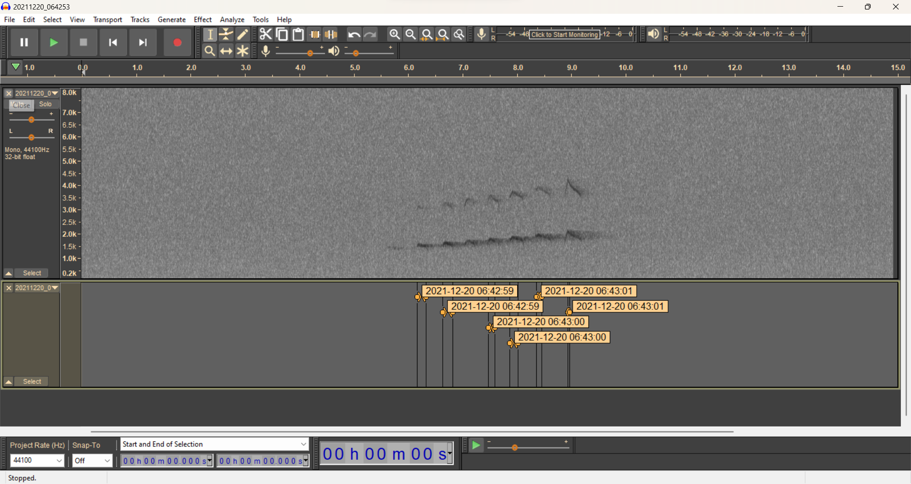

## `NocMigR2` package

------------------------------------------------------------------------

*Replacing earlier version
[NocMigR](https://github.com/mottensmann/NocMigR)*

------------------------------------------------------------------------

This package provides workflows for processing sound files, especially
comprising bird vocalisations sampled with autonomous recording devices
(e.g., `NocMig`, `NFC` and `AudioMoth` recordings), with a main emphasis
on (semi-)automatising the the detection and labelling of events with
proper times-stamps. Resulting data can then be reviewed and validated
using [Audacity](https://www.audacityteam.org/) (recommended version
3.0.2).

Among others, this package relies on the following libraries:

**R packages**:
[bioacoustics](https://cran.r-project.org/package=bioacoustics),
[seewave](https://cran.r-project.org/package=seewave),
[tuneR](https://cran.r-project.org/package=tuneR),
[WarbleR](https://cran.r-project.org/package=warbleR)

**python**: [audioop](https://docs.python.org/3/library/audioop.html),
[BirdNET-Analyzer](https://github.com/kahst/BirdNET-Analyzer),
[pydub](https://github.com/jiaaro/pydub)

To install the package, use
[devtools](https://github.com/r-lib/devtools):

``` r
devtools::install_github("mottensmann/NocMigR2")
```

*`NocMigR2` depends on `warbleR` which is currently (as of 2024-07-26)
missing on CRAN. If the installation above fails try:*

``` r
devtools::install_github("maRce10/warbleR")
```

Load the package once installed:

``` r
library(NocMigR2)
```

### Preprocessing & formatting

------------------------------------------------------------------------

##### `rename_recording`

------------------------------------------------------------------------

*Rename audio files using a string of the form `YYYYMMDD_HHMMSS` that
denotes the date and time of the recording start.*

This convenient format is for example used by the
[AudioMoth](https://www.openacousticdevices.info/)), whereas other
popular recording devices (e.g. PCM recorders by Olympus, Tascam and
alike) typically use rather uninformative naming schemes (date +
chronological number at best). `rename_recording` retrieves the `ctime`
(creation time) from audio files to compose a date_time
(`'YYYYMMDD_HHMMSS'`}) string. Note, audio recorders vary in the way
individual audio files are saved when in continuous recording mode.
Supported options are:

1)  `ctime = 'first'`: (e.g. Olympus LS-3) Each audio file shares the
    ctime of the **first** file. Therefore *ctime* of subsequent
    recordings are easily computed.

2)  `ctime = 'each'`: (e.g. Sony PCM D100) *Each* audio file is handled
    individually and therefore saved with unique *ctime*.

``` r
## Example: 
## new.name corresponds to creation time of package!
## -------
rename_recording(
  ## path to file(s)
  path = system.file("extdata", package = "NocMigR2"),
  ## specify how to handle ctimes
  ctime = "first",
  ## file extension
  format = "wav",
  ## only show new name
  .simulate = TRUE)
#>              old.name            new.name
#> 1 20211220_064253.wav 20240806_142737.wav
```

##### `dusk2dawn`

------------------------------------------------------------------------

Retrieve time of dusk and dawn for a given location using the
[suncalc](https://github.com/datastorm-open/suncalc/) package:

``` r
## Example
## -------
dusk2dawn(
  date = Sys.Date(), ## Date
  lat = 52.032090, ## Latitude in decimal degrees
  lon = 8.516775, # Longitude in decimal degrees
  tz = "CET") # Time zone
#>                  dusk                dawn                    string
#> 1 2024-08-06 21:49:09 2024-08-07 05:18:52 6.8-7.8.2024, 21:49-05:18
```

##### `NocMig_meta`

------------------------------------------------------------------------

Create header used to add a comment to observation lists
[ornitho](https://www.ornitho.de/):

Composing a string describing a past **NocMig** night following
recommendations by [Schütze *et al* 2022
(HGON)](https://www.hgon.de/fileadmin/HGONContent/03-Beobachten/07-NocMig/NocMig_Methodenstandardisierung_V1.pdf)
using:

- [Bright Sky](https://brightsky.dev/) (de Maeyer 2020) to retrieve
  weather data for a given location.
- [suncalc](https://github.com/datastorm-open/suncalc/) to retrieve time
  of dusk and dawn

``` r
## usage -------
NocMig_meta(date = Sys.Date() - 1, lat = 52.032, lon = 8.517)
#> Teilliste 1: 5.8-6.8.2024, 21:51-05:17, trocken, 15°C, SE, 11 km/h 
#> Teilliste 2: 5.8-6.8.2024, 21:51-05:17, trocken, 14°C, SSW, 4 km/h
```

##### `BirdNET_species.list`

------------------------------------------------------------------------

Create custom species list for target species:

Filters the extensive
[BirdNET_GLOBAL_6K_V2.4_Labels](https://github.com/kahst/BirdNET-Analyzer/tree/main/checkpoints/V2.4)
file for selected target species. Target species can be selected based
on scientific species names or common species names in all languages
currently supported by
[BirdNET-Analyzer](https://github.com/kahst/BirdNET-Analyzer).

``` r
## examples
## --------
BirdNET_species.list(
  ## target species
  names = c("Glaucidium passerinum", "Bubo bubo"),
  sciNames = TRUE,
  BirdNET_path = "../BirdNET-Analyzer/",
  species_list = "Insert Path here ... ",
  ## only show df, not exporting to text file
  .write_text = FALSE) 
#>                 sciName            comName
#> 1             Bubo bubo Eurasian Eagle-Owl
#> 2 Glaucidium passerinum Eurasian Pygmy-Owl

BirdNET_species.list(
  names = c("Sperlingskauz", "Uhu"),
  lang = "de",
  sciNames = FALSE,
  BirdNET_path = "../BirdNET-Analyzer/",
  species_list = "Insert Path here ... ",
  ## only show df, not exporting to text file
  .write_text = FALSE)
#>                 sciName            comName
#> 1             Bubo bubo Eurasian Eagle-Owl
#> 2 Glaucidium passerinum Eurasian Pygmy-Owl
```

### Analyses using `BirdNET-Analyzer`

------------------------------------------------------------------------

**Using BirdNET-Analyzer to process audio data**

##### Prerequisites:

###### On windows:

- Installing **Ubuntu** environment. **Windows Subsystem for Linux
  (WSL)** works well for this purpose. see
  [WSL](https://learn.microsoft.com/en-us/windows/wsl/install) for
  explanations
- Setup **BirdNET-Analyzer** following the [Setup
  Ubuntu](https://github.com/kahst/BirdNET-Analyzer#33-setup-ubuntu)
  section

Then `bash` code-chunks (shown below) can be executed using WSL. Pre-
and post processing stays within R.

###### On Linux (Raspberry Pi):

- Setup **BirdNET-Analyzer** following the [Setup
  Ubuntu](https://github.com/kahst/BirdNET-Analyzer#33-setup-ubuntu)
  section

Then, using
[RStudio](https://www.rstudio.com/products/rstudio/download/)
`analyzer.py` can be used by simply inserting `bash` code-chunks within
RMarkdown documents!

###### `analyzer.py`

------------------------------------------------------------------------

Using `analyzer.py` for detecting signals:

- Use the sample audio file for demonstration purposes:

``` r
## create temp folder
dir.create("test_folder")
#> Warning in dir.create("test_folder"): 'test_folder' already exists

## Copy sample
sample <- system.file("extdata", "20211220_064253.wav", package = "NocMigR2")
file.copy(from = sample, to = file.path("test_folder", "20211220_064253.wav"))
```

- Run `analyzer.py` (See documentation
  [here](https://github.com/kahst/BirdNET-Analyzer#41-usage-cli))

``` bash
## bash
## -----------------------------------
## Set working dir to BirdNET-Analyzer
cd PATH TO BirdNET-Analyzer
```

``` bash
## bash
## ---------------
## run analyze.py
python3 analyze.py --i /test_folder --o /test_folder 
--min_conf 0.7 --rtype 'audacity' --threads 1 --locale 'de'
```

``` bash
## Example RStudio on Raspberry Pi 4
## -----------------------------------------------------------------------------
cd ../BirdNET-Analyzer
python3 analyze.py --i ../NocMigR2/test_folder --o ../NocMigR2/test_folder --min_conf 0.7 --rtype 'audacity'
```

#### `BirdNET`

The function `BirdNET` (see *?BirdNET* for details) does the following:

1)  Reshape audacity labels created by `analyze.py` (with
    `--rtype 'audacity'`) to include the event time estimated from file
    names: \[Creates `BirdNET.labels.txt` for each `BirdNET.results.txt`
    file\]
2)  Write records to BirdNET.xlsx as a template to simplify inspection
    and verification of the records.

``` r
df <- BirdNET(path = "test_folder/",
              ## adding optional meta data
              meta = BirdNET_meta(
                Location = "Place A",
                Lat = 52,
                Lon = 8,
                Device = "Recorder B",
                Micro = "Mic C",
                ## analyze.py settings
                Min_conf = 0.7,
                Overlap = 0,
                Sensitivity = 1.0,
                Slist = "BirdNET_V2.4"))
#> Calculate total duration of 1 recordings:
#> Created test_folder//BirdNET.xlsx
```

``` r
## load and show overview overview
str(openxlsx::read.xlsx("test_folder/BirdNET.xlsx", "Records"))
#> 'data.frame':    1 obs. of  12 variables:
#>  $ Taxon       : chr "Eurasian Pygmy-Owl"
#>  $ Detector    : chr "BirdNET"
#>  $ ID          : num NA
#>  $ T1          : num 44550
#>  $ T2          : num 44550
#>  $ Score       : num 0.776
#>  $ Verification: num NA
#>  $ Correction  : num NA
#>  $ Quality     : num NA
#>  $ Comment     : num NA
#>  $ T0          : num 44550
#>  $ File        : chr "test_folder/20211220_064253.BirdNET.results.txt"
str(openxlsx::read.xlsx("test_folder/BirdNET.xlsx", "Meta"))
#> 'data.frame':    1 obs. of  12 variables:
#>  $ Location   : chr "Place A"
#>  $ Lat        : num 52
#>  $ Lon        : num 8
#>  $ From       : num 44550
#>  $ To         : num 44550
#>  $ Duration   : chr "14.92 seconds"
#>  $ Device     : chr "Recorder B"
#>  $ Micro      : chr "Mic C"
#>  $ Min_conf   : num 0.7
#>  $ Overlap    : num 0
#>  $ Sensitivity: num 1
#>  $ Slist      : chr "BirdNET_V2.4"
```

------------------------------------------------------------------------

##### `BirdNET_extract`

Extract detections and export them as wave files. For easier access to
verify records files are named as ‘Species_Date_Time.WAV’ and
corresponding hyperlinks are inserted in the .xlsx file created with
`BirdNET()` (see below).

``` r
## extract events and add hyperlink
BirdNET_extract(path = "test_folder", hyperlink = TRUE)
#> Extract events ...
```

``` r
## show created dirs
list.dirs("test_folder/extracted/", recursive = F)
#> [1] "test_folder/extracted/Eurasian Pygmy-Owl"

## show content for Eurasian Pygmy-OWl
list.files("test_folder/extracted/Eurasian Pygmy-Owl/")
#> [1] "Eurasian Pygmy-Owl_20211220_064259.WAV"
```

- Content of `xlsx file`

Summary table of BirdNET detection ready for manual review &
verification (attributes: `Verification`, `Correction`, `Comment`).
Automatically provided are BirdNET annotations (Taxon) along with the
corresponding confidence score (`Score`) and event time (`T1` = start,
`T2` = end). Manually recovered events may be added to the same file by
setting `Detector = 'Manual'` or alike}

<div class="figure" style="text-align: center">


<p class="caption">
Screenshot: xlsx file. Fields to enter manually shown in bold
</p>

</div>

##### `BirdNET_archive`

------------------------------------------------------------------------

**Under development**

Archive **verified** records (see screenshot above) using
`BirdNET_archive`:

``` r
out <- BirdNET_archive(BirdNET_results = "test_folder/BirdNET.xlsx", path2archive = "test_folder",
    db = "test_folder/db.xlsx", NocMig = FALSE, keep.false = TRUE)
str(out)
#> 'data.frame':    1 obs. of  19 variables:
#>  $ Date       : chr "2021-12-20"
#>  $ Taxon      : chr "Eurasian Pygmy-Owl"
#>  $ sum        : int 1
#>  $ sum1       : int 0
#>  $ str1       : logi NA
#>  $ sum2       : int 1
#>  $ str2       : chr "06:1"
#>  $ Location   : chr "Place A"
#>  $ Lat        : num 52
#>  $ Lon        : num 8
#>  $ From       : POSIXct, format: "2021-12-20 06:42:53"
#>  $ To         : POSIXct, format: "2021-12-20 06:43:07"
#>  $ Duration   : chr "14.92 seconds"
#>  $ Device     : chr "Recorder B"
#>  $ Micro      : chr "Mic C"
#>  $ Min_conf   : num 0.7
#>  $ Overlap    : num 0
#>  $ Sensitivity: num 1
#>  $ Slist      : chr "BirdNET_V2.4"

## show folder structure
list.files("test_folder/")
#> [1] "20211220_064253.BirdNET.labels.txt"  "20211220_064253.BirdNET.results.txt"
#> [3] "20211220_064253.wav"                 "BirdNET.xlsx"                       
#> [5] "db.xlsx"                             "extracted"                          
#> [7] "False positives"                     "True positives"
```

------------------------------------------------------------------------

#### Optional functions

------------------------------------------------------------------------

*Mainly a backup from previous package
[NocMigR](https://github.com/mottensmann/NocMigR))*

##### `find_events` & `extract_events`

------------------------------------------------------------------------

Signal detection based on SNR (signal to noise ratio) wrapping
`threshold_detection()` of the
[bioacoustics](https://cran.r-project.org/package=bioacoustics) package.
Additional parameters allow further fine-tuning by specifying frequency
characteristics and call length of targets of interest. *Note: For bird
calls using
[BirdNET-Analyzer](https://github.com/kahst/BirdNET-Analyzer) is the
recommended alternative*. Detections are exported as Audacity labels
using [seewave](https://rug.mnhn.fr/seewave/):

``` r
TD <- find_events(wav.file = "test_folder/20211220_064253.wav",
                  audacity = TRUE, # Write audacity labels
                  threshold = 8, # SNR in db
                  min_dur = 20, # min length in ms
                  max_dur = 300, # max length in ms
                  LPF = 5000, # low-pass filter at 500 Hz
                  HPF = 1000) # high-pass filter at 4 kHz

## Review events 
head(TD$data$event_data[,c("filename", "starting_time", "duration", "freq_max_amp")])
#>              filename starting_time  duration freq_max_amp
#> 1 20211220_064253.wav  00:00:06.169 169.07029     1483.850
#> 2 20211220_064253.wav  00:00:06.638 192.29025     1647.574
#> 3 20211220_064253.wav  00:00:07.481 116.09977     1790.988
#> 4 20211220_064253.wav  00:00:07.872 150.20408     1900.730
#> 5 20211220_064253.wav  00:00:08.365  94.33107     2032.121
#> 6 20211220_064253.wav  00:00:08.945  29.02494     2180.925
```

If `audacity = TRUE` a file with labels for reviewing events in
`Audacity` is created (wrapping `seewave::write.audacity()`).

<div class="figure" style="text-align: center">


<p class="caption">
Screenshot: Audacity labels
</p>

</div>

- Extract detected events from raw audio file

Refines the output of `find_events` by first adding a buffer (default 1
second on both sides of the event) and subsequently merging overlapping
selections (detections likely belonging to the same calling event) to
make the output more pretty. Additionally, allows to filter based on
expected frequencies (i.e., checks maximum amplitude frequency is within
the frequency band defined by `LPF` and `HPF`). Returns a shortened
audio file containing only the selected events (e.g,
*“20211220_064253_extracted.txt”* along with the corresponding Audacity
labels *“20211220_064253_extracted.txt”*)

``` r
## extract events based on object TD
df <- extract_events(threshold_detection = TD, path = "test_folder", format = "wav",
    LPF = 4000, HPF = 1000, buffer = 1)
```

##### `split_wave`:

------------------------------------------------------------------------

Basic function to split large audio files in chunks. *Internally calls
the python library [pydub](https://github.com/jiaaro/pydub) with
[reticulate](https://rstudio.github.io/reticulate/).*:

Short audio segments are saved in a subfolder named ‘split’.

``` r
## split in segments
split_wave(file = "20211220_064253.wav", # audio file
           path = "test_folder/", # folder 
           segment = 3) # cut in 3 sec segments
#> Split ...

## show files
list.files("test_folder/split/")
#> [1] "20211220_064253.wav" "20211220_064256.wav" "20211220_064259.wav"
#> [4] "20211220_064302.wav" "20211220_064305.wav"
```
